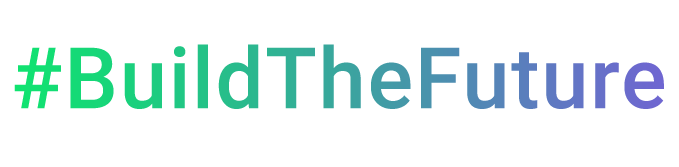
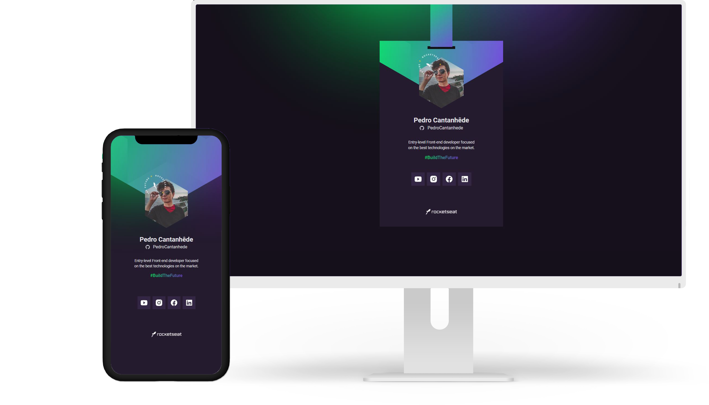
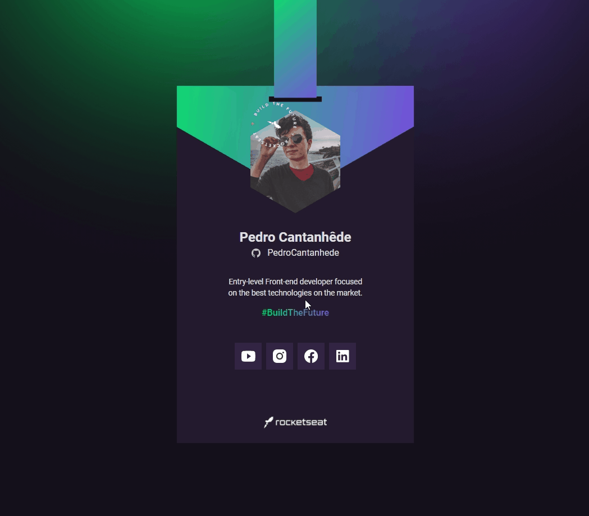
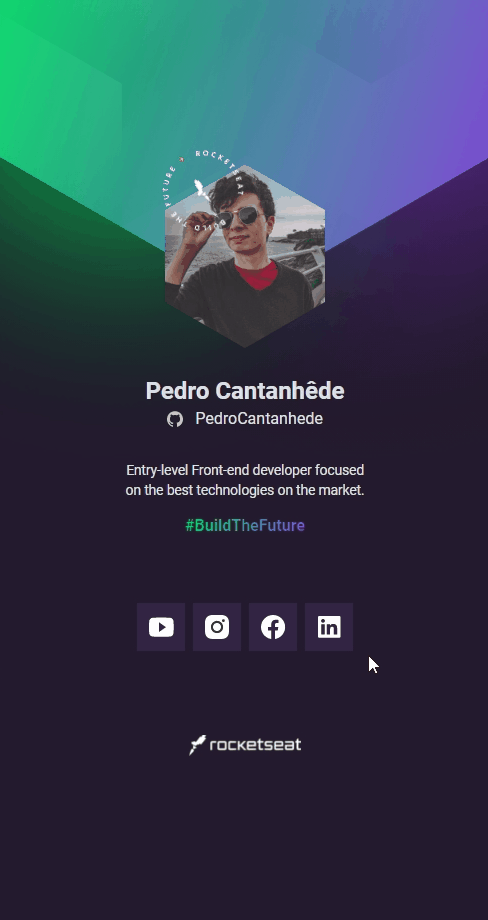
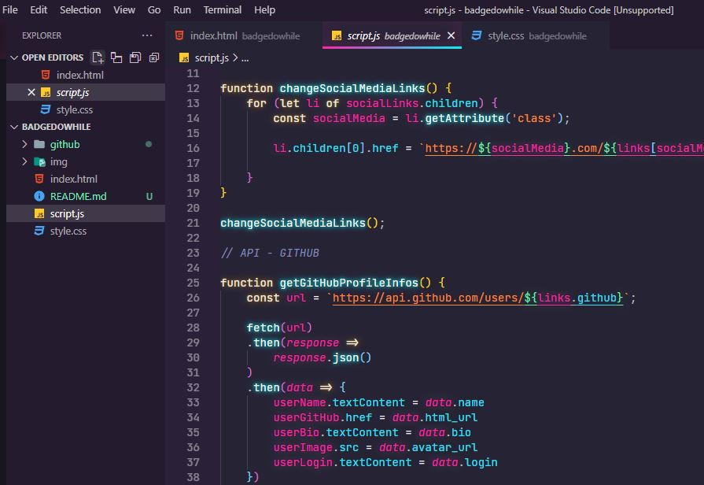

<h1 align="center">
    
</h1>

    <h3> ♾️ NLW Heat - Mission Origin ♾️ </h3>
    
    
     
    
    

## Badge-DoWhile

Aplicação realizada na missão Origin do NLW Heat (Next Level Week - Heat) onde as pessoas podem gerar seu crachá para participar do evento DoWhile 2021. A aplicação é simples, visando ensinar e reforçar os fundamentos da programação para quem está no início da jornada.  

  

## 🛠️ Tecnologias

💻 HTML

💻 CSS

💻 JavaScript

## :camera: Veja:

### 🖥️ Desktop

### 📱 Mobile

### ☑️ Código:

## ♾️ Rocketseat

A ajuda das aulas disponibilizadas durante a semana da NLW foi essencial para que eu chegasse no final do projeto. Deixo meus agradecimentos aos professores **Mayk Brito** e **Jakeliny Gracielly**. 

